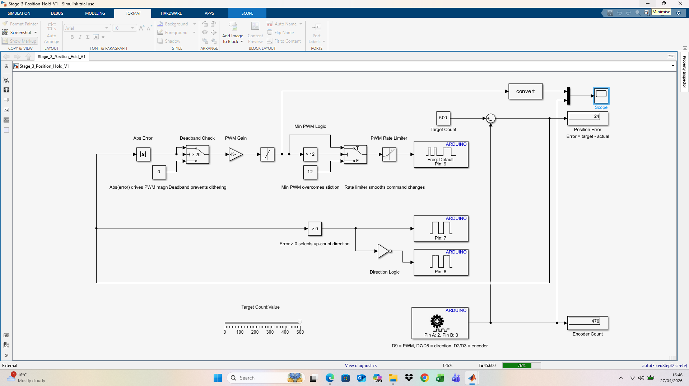
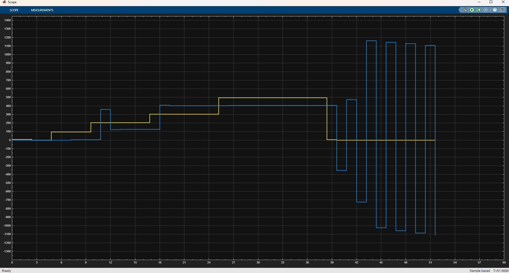
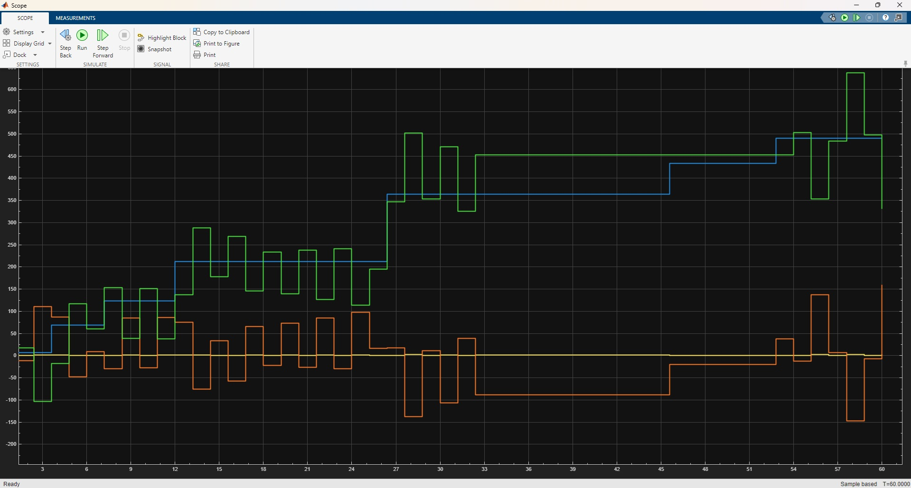

# Simulink-Based Closed-Loop Motor Position Control on Arduino

A small embedded motor-control demonstrator developed in **Simulink** using **Arduino hardware**, **PWM motor drive**, and **quadrature encoder feedback**. The project was used to build practical experience in closed-loop control development, hardware interfacing, model deployment, and controller tuning on a real physical system.

The work progressed from simple open-loop motor actuation to encoder-based position feedback, then to a practical closed-loop position-hold controller, followed by comparison against a cleaner proportional controller structure.

## Project Overview

### Hardware Setup


### Stage 3: Practical Position-Hold Controller


### Stage 4: Proportional Controller Comparison


### Stage 5: Disturbance Rejection Response


## Project Aim

The aim of the project was to develop a hands-on Simulink-based control demonstrator that would:

- deploy a motor-control model to Arduino hardware
- integrate quadrature encoder feedback
- implement and tune closed-loop position control
- compare a practical hand-built controller against a cleaner proportional structure
- observe how real hardware effects such as friction, backlash, breakaway torque, and quantised feedback influence behaviour

## Hardware and Software

### Hardware
- Arduino Uno R3 for Simulink-based control and encoder support
- Arduino Uno R4 Minima used earlier for initial open-loop Simulink motor control
- Micro metal geared DC motor with quadrature encoder
- TB6612FN motor driver
- External battery pack for motor drive
- Breadboard and jumper wiring for rapid prototyping

### Software
- MATLAB and Simulink
- Simulink support package for Arduino hardware
- Simulink dashboard controls for live target and command adjustment

## Project Stages

### Stage 1: Open-Loop Motor Control
**Objective:** Prove basic motor actuation from Simulink by controlling speed and direction through the motor driver.

**Implementation:**
- PWM output from Simulink to D9
- Direction control from Simulink to D7 and D8
- TB6612FNG used as the motor driver interface
- Dashboard slider used for live PWM adjustment
- Dashboard rocker switch used for live direction control

**Outcome:**
- Motor speed was controlled successfully from Simulink
- Motor direction could be reversed live from the dashboard
- Proven signal chain from model to hardware

### Stage 2: Encoder Feedback and First Closed Loop
**Objective:** Add position feedback using the motor encoder and build the first closed-loop position control structure in Simulink.

**Implementation:**
- Quadrature encoder connected to D2 and D3
- Encoder count read into Simulink and displayed live
- Open-loop direction testing used to confirm sign convention
- Direction determined from the sign of the error
- PWM demand based on the magnitude of the error

**Outcome:**
- Encoder feedback was successfully integrated into Simulink
- Motor driven while encoder count updated live
- First real closed-loop position controller achieved
- Project moved to command-and-feedback control

### Stage 3: Tuned Practical Position-Hold Controller
**Objective:** Improve the first closed-loop controller into a practical position-hold system that could move to a target and remain near it on real hardware.

**Implementation:**
- Error = `targetCount - actualCount`
- If error > 0, command up-count direction
- If error < 0, command down-count direction
- If error is inside deadband, stop
- If motion is required but demand is too small, apply minimum PWM

**Outcome:**
- The controller could move toward a commanded target and hold position reasonably well
- Live target changes could be followed in Simulink
- The model was much more usable on real hardware than the earlier controller

**Key learning:**
- Deadband had to operate on raw position error counts
- Minimum PWM was required to overcome stiction
- Breakaway threshold for this setup was approximately PWM = 12
- Too much minimum PWM caused rocking, while too little caused no movement at all

### Stage 4: Proportional Controller Comparison
**Objective:** Compare the practical Stage 3 controller against a cleaner proportional control structure in Simulink.

**Comparison approach:**
- Stage 4A: pure proportional controller
- Stage 4B: proportional controller with deadband and rate limiter
- Stage 4C: further command limiting to improve large-step behaviour

**Outcome:**
- The proportional controller was simpler and cleaner than the Stage 3 logic
- It was less robust on the real motor/gearbox system
- Small target changes could be handled acceptably
- Larger target changes led to oscillation and repeated reversal
- Reduced command limiting did not fully remove the underlying instability

**Key learning:**
- Cleaner controller architecture does not necessarily perform better on real hardware
- For this setup, backlash, stiction, breakaway torque, and encoder quantisation strongly influenced the response
- Stage 3 remained the more usable controller in practice

### Stage 5: Disturbance Rejection and Observations
**Objective:** Observe how the controller behaved when a target position changed, and assess how well it could hold and recover on real hardware.

**Implementation:**
- Target count changed during live operation
- Response and recovery behaviour observed using Simulink scopes
- Signals viewed together included:
  - Target Count
  - Encoder Count
  - Position Error
  - PWM Command

**Outcome:**
- The controller followed target changes and produced the expected corrective response
- Encoder tracked the commanded position, but not perfectly
- Position error reduced after target changes, but some residual oscillation remained rather than a perfectly quiet hold

**Key learning:**
- Friction, backlash, breakaway torque, and encoder quantisation all affected final hold quality
- Stage 3 remained the most practical controller because it combined deadband, minimum PWM, and rate limiting

## Key Tuning Lessons

- **Sign convention must be proven** before tuning:
  - `D7 = 1, D8 = 0` increased count
  - `D7 = 0, D8 = 1` decreased count
- **Deadband must act on position error**
- **Breakaway friction must be overcome**
- The practical threshold for this system was found to be **PWM = 12**
- **High minimum PWM causes oscillation**
- Real hardware non-idealities dominated the behaviour far more than a simple model would suggest
- Cleaner control laws were not automatically better on this plant

## Results and Conclusions

A complete Simulink-based motor-control demonstrator was developed using Arduino hardware. The project progressed from:

- open-loop actuation
- to encoder feedback
- to closed-loop position control
- to controller comparison and tuning

The most practically successful controller was the **Stage 3 position-hold controller**, combining:

- deadband
- minimum PWM
- rate limiting

The **Stage 4 proportional controller** was cleaner structurally, but less robust on the motor/gearbox system.

The project showed clearly that real hardware effects such as friction, backlash, breakaway torque, and encoder quantisation strongly affect control behaviour.

The most valuable outcome was not simply making the motor move, but understanding how controller structure, tuning choices, and plant non-linearities interact on a real embedded control system.

## Suggested Repository Structure

```text
.
├── README.md
├── presentation/
│   └── Simulink Closed Loop Control Project.pdf
├── models/
│   ├── Stage_1_*.slx
│   ├── Stage_2_*.slx
│   ├── Stage_3_*.slx
│   ├── Stage_4_*.slx
│   └── Stage_5_*.slx
├── images/
│   ├── hardware_setup.jpg
│   ├── stage2_model.png
│   ├── stage3_model.png
│   ├── stage4_model.png
│   └── stage5_scope.png
└── notes/
    └── lessons_learned.md
